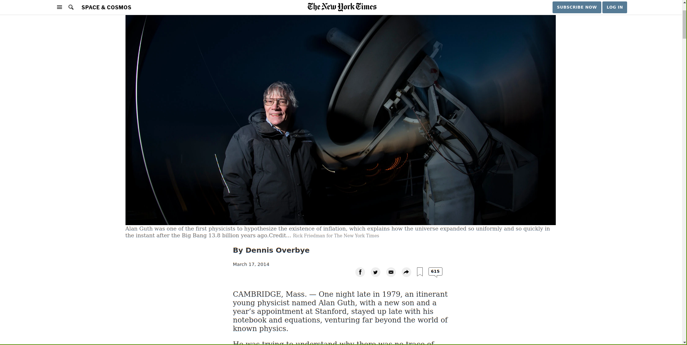

# New York Times News Page Clone v0.1.0

This is just a clone of a news page from the [new york times](https://www.nytimes.com/2014/03/18/science/space/detection-of-waves-in-space-buttresses-landmark-theory-of-big-bang.html?_r=0) website

## Built With

- HTML, CSS & Javascript

## Live Demo

[Live Demo Link](https://adfpizarro.github.io/NyTimesClone)

## Getting Started

To get a local copy up and running follow these simple example steps.

### Usage
- Just open the `index.html` file

## Commands
- `lintcss` Checks the css for any lint errors
- `lintcss:fix` Checks the css for any lint errors and tries to fix what it can

Note: You need to do `npm install` before executing the commands above.

## Authors

👤 **WinterCore**

- Github: [@WinterCore](https://github.com/WinterCore)

👤 **Adrian Flores Pizarro**

- Github: [@AdfPizarro](https://github.com/AdfPizarro)
- Twitter: [@AdfPizarro](https://twitter.com/adfpizarro)
- Linkedin: [adrian-flores-pizarro-73b62316a](https://www.linkedin.com/in/adrian-flores-pizarro-73b62316a/) 

## 🤝 Contributing

Contributions, issues and feature requests are welcome!

Feel free to check the [issues page](issues/).

## Show your support

Give a ⭐️ if you like this project!

## Acknowledgments

- Hat tip to anyone whose code was used
- Inspiration
- etc

## 📝 License

This project is [MIT](lic.url) licensed.